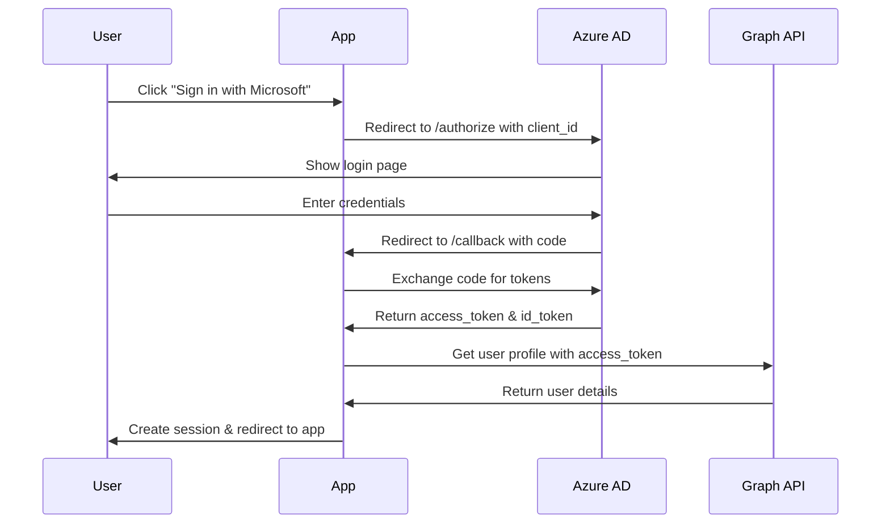

# OAuth 2.0 Setup Guide for Azure AD

## ✅ Implementation Complete!

We've successfully implemented OAuth 2.0 authentication with Microsoft Azure AD for your car booking system. This is much simpler and more reliable than SAML.

## 🔧 What's Been Configured

### 1. OAuth Endpoints Created
- **Login**: `/api/auth/azure/login` - Initiates OAuth flow
- **Callback**: `/api/auth/azure/callback` - Handles Azure AD response
- **Configuration**: Using Microsoft Authentication Library (MSAL)

### 2. Azure AD Application Settings
- **Client ID**: `8dbe7621-14fe-46aa-9968-77d6500e429e`
- **Tenant ID**: `ead30324-2c2a-42bf-9541-bf96019df2c6`
- **Redirect URI**: `http://localhost:3001/api/auth/azure/callback`

## 📋 Required Azure Portal Configuration

### Step 1: Create Client Secret

1. Go to [Azure Portal](https://portal.azure.com)
2. Navigate to **Azure Active Directory** → **App registrations**
3. Select your application: **Carbooking-SGS**
4. Go to **Certificates & secrets** → **Client secrets**
5. Click **New client secret**
   - Description: `Car Booking OAuth Secret`
   - Expires: Choose 24 months
6. **COPY THE SECRET VALUE IMMEDIATELY** (shown only once)

### Step 2: Configure Authentication

1. In your app registration, go to **Authentication**
2. Under **Platform configurations**, click **Add a platform**
3. Select **Web**
4. Add Redirect URIs:
   ```
   http://localhost:3001/api/auth/azure/callback
   https://carbooking-sgs.siamgs.co.th/api/auth/azure/callback
   ```
5. Under **Implicit grant and hybrid flows**:
   - ✅ Check **ID tokens**
   - ✅ Check **Access tokens**
6. Click **Save**

### Step 3: Configure API Permissions

1. Go to **API permissions**
2. Ensure these permissions are granted:
   - `openid` - Sign users in
   - `profile` - View users' basic profile
   - `email` - View users' email address
   - `User.Read` - Sign in and read user profile
3. Click **Grant admin consent** if required

## 🔐 Local Configuration

### Update `.env.local`

Add the client secret from Step 1:

```env
# Azure AD OAuth Configuration
AZURE_CLIENT_SECRET=YOUR_SECRET_VALUE_FROM_AZURE

# Session Secret (generate a secure random string)
SESSION_SECRET=generate-a-random-32-character-string-here
```

### Generate Session Secret

Run this command to generate a secure session secret:
```bash
node -e "console.log(require('crypto').randomBytes(32).toString('hex'))"
```

## 🚀 Testing OAuth Flow

### 1. Restart the Development Server
```bash
# Kill current server (Ctrl+C)
# Start again to load new environment variables
npm run dev
```

### 2. Test Authentication
1. Navigate to http://localhost:3001/login
2. Click **"Sign in with Microsoft (OAuth 2.0)"**
3. You'll be redirected to Microsoft login
4. Sign in with your corporate account
5. Grant permissions if prompted
6. You'll be redirected back to the app, logged in!

## 🔍 How OAuth Flow Works



## 📊 OAuth vs SAML Comparison

| Feature | OAuth 2.0 (Current) | SAML (Previous) |
|---------|-------------------|-----------------|
| Setup Complexity | ✅ Simple | ❌ Complex |
| Azure AD Support | ✅ Excellent | ⚠️ Limited |
| Token Format | ✅ JWT (JSON) | ❌ XML |
| Debugging | ✅ Easy | ❌ Difficult |
| Mobile Support | ✅ Yes | ❌ No |
| API Access | ✅ Yes | ❌ No |

## 🛠️ Troubleshooting

### Common Issues and Solutions

#### 1. "Invalid client secret"
- Ensure you copied the secret value (not the secret ID)
- Check for extra spaces or line breaks
- Secret might be expired - create a new one

#### 2. "Redirect URI mismatch"
- Exact match required (including trailing slashes)
- Add both http://localhost:3001 and production URLs
- Check for typos in Azure Portal

#### 3. "Permissions required"
- Admin consent might be needed
- Ask your Azure AD admin to grant consent
- Check API permissions in Azure Portal

#### 4. "Session not persisting"
- Check SESSION_SECRET is set
- Ensure cookies are enabled
- Check browser console for errors

## 🔒 Security Best Practices

1. **Never commit secrets to git**
   - Use `.env.local` (already in .gitignore)
   - Use environment variables in production

2. **Use HTTPS in production**
   - OAuth requires secure connections
   - Update redirect URIs accordingly

3. **Rotate secrets regularly**
   - Azure allows multiple secrets
   - Rotate every 6-12 months

4. **Implement token refresh**
   - Access tokens expire after 1 hour
   - Implement refresh token flow for long sessions

## 📱 Production Deployment

### 1. Update Environment Variables
```env
# Production settings
AZURE_CLIENT_SECRET=your-production-secret
SESSION_SECRET=your-production-session-secret
NEXT_PUBLIC_APP_URL=https://carbooking-sgs.siamgs.co.th
```

### 2. Update Azure AD Configuration
Add production redirect URI:
```
https://carbooking-sgs.siamgs.co.th/api/auth/azure/callback
```

### 3. Update OAuth Configuration
The configuration automatically uses production URLs when `NODE_ENV=production`

## 🎯 Next Steps

1. ✅ Add client secret to `.env.local`
2. ✅ Test OAuth login flow
3. ⬜ Implement token refresh for long sessions
4. ⬜ Add role-based access control
5. ⬜ Implement logout functionality
6. ⬜ Add user profile page

## 📚 Additional Resources

- [Microsoft Identity Platform Docs](https://docs.microsoft.com/en-us/azure/active-directory/develop/)
- [MSAL.js Documentation](https://github.com/AzureAD/microsoft-authentication-library-for-js)
- [OAuth 2.0 Specification](https://oauth.net/2/)
- [Microsoft Graph API](https://docs.microsoft.com/en-us/graph/)

## ✨ Benefits of OAuth over SAML

1. **Simpler Implementation** - No complex XML parsing
2. **Better Azure Support** - Microsoft's preferred method
3. **Modern Architecture** - JSON-based, REST APIs
4. **Mobile Ready** - Works with native mobile apps
5. **API Access** - Can call Microsoft Graph API
6. **Better Debugging** - Clear error messages
7. **Active Development** - Continuously improved

## 🎉 Success!

Your OAuth 2.0 implementation is ready! Just add the client secret and test the login flow.