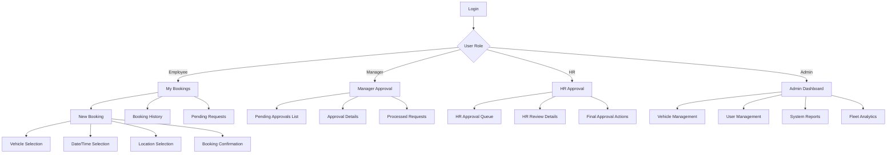
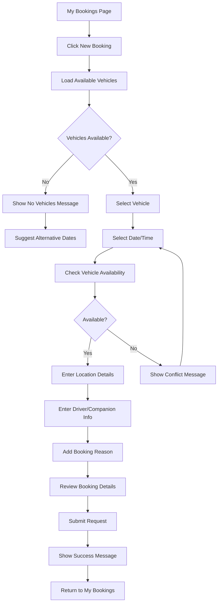
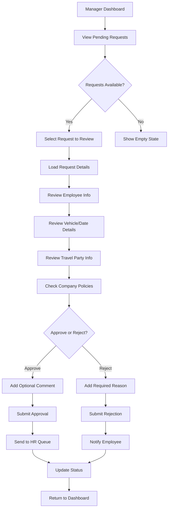
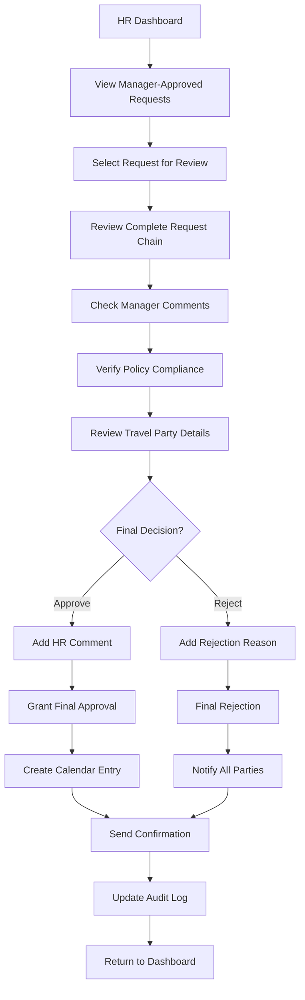

# Car Booking System UI/UX Specification

This document defines the user experience goals, information architecture, user flows, and visual design specifications for Car Booking System's user interface. It serves as the foundation for visual design and frontend development, ensuring a cohesive and user-centered experience.

## Overall UX Goals & Principles

### Target User Personas

**Employee User:** Company employees who need to book vehicles for business purposes. They prioritize quick booking processes, clear status updates, and easy cancellation/modification capabilities.

**Manager User:** Team managers who approve booking requests from their direct reports. They need efficient approval workflows, clear request details, and ability to provide feedback comments.

**HR User:** HR personnel who provide final approval for manager-approved requests. They focus on policy compliance, comprehensive request review, and maintaining audit trails.

**Administrator:** System administrators who manage the vehicle fleet, user permissions, and system configurations. They require comprehensive management tools and system oversight capabilities.

### Usability Goals

- **Ease of learning:** New users can complete core tasks within 3 minutes of first use
- **Efficiency of use:** Regular users can create a booking request in under 2 minutes
- **Error prevention:** Clear validation and confirmation flows prevent booking conflicts and policy violations
- **Memorability:** Infrequent users can return without relearning the interface
- **Mobile responsiveness:** Full functionality available on mobile devices for on-the-go access

### Design Principles

1. **Clarity over cleverness** - Prioritize clear communication and intuitive interfaces over aesthetic innovation
2. **Progressive disclosure** - Show only relevant information for current user role and task context
3. **Consistent patterns** - Use familiar UI patterns from shadcn/ui library throughout the application
4. **Immediate feedback** - Every user action receives clear, immediate visual and contextual response
5. **Accessible by default** - Design meets WCAG 2.1 AA standards from the start

### Change Log

| Date | Version | Description | Author |
|------|---------|-------------|---------|
| 2024-12-19 | 1.0 | Initial specification for tRPC API integration | Claude Code |

## Information Architecture (IA)

### Site Map / Screen Inventory



### Navigation Structure

**Primary Navigation:** Role-based dashboard with main action areas prominently displayed in header

**Secondary Navigation:** Contextual tabs within each major section (e.g., Pending/Approved/Rejected in My Bookings)

**Breadcrumb Strategy:** Minimal breadcrumbs for deep navigation flows like booking creation; focus on clear page titles and back buttons

## User Flows

### Employee Booking Creation Flow

**User Goal:** Book a company vehicle for business travel

**Entry Points:** "New Booking" button from My Bookings page, direct navigation to booking page

**Success Criteria:** Booking request submitted successfully and user receives confirmation with tracking information

#### Flow Diagram



#### Edge Cases & Error Handling:
- **Vehicle unavailable after selection:** Show real-time availability check with alternative suggestions
- **Network connectivity issues:** Implement offline detection with retry mechanisms
- **Validation errors:** Highlight specific fields with clear error messages
- **Session timeout:** Auto-save draft and prompt for re-authentication

**Notes:** Implement real-time availability checking and auto-save functionality for booking drafts

### Manager Approval Workflow

**User Goal:** Review and approve/reject booking requests from team members

**Entry Points:** Direct access to Manager Approval dashboard upon login

**Success Criteria:** Decision made on request with optional comments, notifications sent to requestor

#### Flow Diagram



#### Edge Cases & Error Handling:
- **Concurrent approvals:** Prevent race conditions with optimistic locking
- **Policy violations detected:** Flag potential issues with warning indicators
- **Approval fails:** Show error message and allow retry with saved comments
- **Auto-logout during review:** Save current progress and restore on re-login

**Notes:** Implement policy validation rules and conflict detection for double-bookings

### HR Final Approval Process

**User Goal:** Provide final approval for manager-approved booking requests

**Entry Points:** HR Approval dashboard showing manager-approved requests

**Success Criteria:** Final decision recorded with audit trail and all parties notified

#### Flow Diagram



#### Edge Cases & Error Handling:
- **Policy changes during review:** Alert to updated policies with impact assessment
- **Vehicle conflicts detected:** Show alternative vehicles or suggest rescheduling
- **External calendar integration fails:** Allow manual calendar entry with notification
- **Notification delivery failures:** Queue for retry with status tracking

**Notes:** Integrate with company calendar systems and maintain comprehensive audit logs

## Wireframes & Mockups

**Primary Design Files:** Existing shadcn/ui components with custom styling for car booking domain

### Key Screen Layouts

#### Car Booking Form

**Purpose:** Streamlined vehicle booking interface with progressive disclosure

**Key Elements:**
- Vehicle selection grid with real-time availability
- Date/time picker with unavailable dates disabled
- Location autocomplete with Google Maps integration
- Driver/companion management with dynamic form fields
- Booking reason categorization with validation

**Interaction Notes:** Auto-save progress, real-time availability checking, mobile-responsive design

**Design File Reference:** CarBookingPage.tsx component with tRPC integration

#### My Bookings Dashboard

**Purpose:** Centralized view of user's booking history and status

**Key Elements:**
- Tabbed interface (Pending, Approved, Rejected)
- Booking cards with status indicators and key details
- Quick actions (cancel, modify, view details)
- Empty states with clear call-to-action

**Interaction Notes:** Real-time status updates, pull-to-refresh on mobile, infinite scroll for history

**Design File Reference:** MyBookingsPage.tsx with tRPC data fetching

#### Approval Workflow Interface

**Purpose:** Efficient approval process for managers and HR

**Key Elements:**
- Split layout: request list and detail view
- Request prioritization and filtering
- Inline commenting and decision making
- Batch approval capabilities for managers

**Interaction Notes:** Keyboard shortcuts for power users, auto-refresh for new requests, contextual help

**Design File Reference:** ManagerApprovalPage.tsx and HRApprovalPage.tsx

## Component Library / Design System

**Design System Approach:** Extend shadcn/ui component library with domain-specific components for car booking functionality

### Core Components

#### VehicleCard
**Purpose:** Display vehicle information with availability status and selection capability

**Variants:** Grid view (default), List view, Compact view for mobile

**States:** Available, Unavailable, Selected, In-use, Maintenance

**Usage Guidelines:** Always show license plate, capacity, and current status. Include high-quality vehicle images.

#### BookingStatusBadge
**Purpose:** Consistent status indicators across all booking contexts

**Variants:** Pending (yellow), Approved (green), Rejected (red), In-progress (blue)

**States:** Default, Compact, With icon, With tooltip

**Usage Guidelines:** Use color and icon combinations for accessibility. Include text labels for screen readers.

#### ApprovalTimeline
**Purpose:** Visual representation of booking approval progress

**Variants:** Horizontal (desktop), Vertical (mobile), Compact

**States:** Current step highlighted, Completed steps, Pending steps

**Usage Guidelines:** Show clear progression with timestamps and responsible parties

#### DateTimeSelector
**Purpose:** Specialized picker for booking date and time selection

**Variants:** Date only, Time only, Combined, Range selection

**States:** Default, With restrictions, Error state, Loading availability

**Usage Guidelines:** Integrate with availability checking API, disable unavailable slots

## Branding & Style Guide

**Brand Guidelines:** Consistent with company visual identity using professional, trustworthy design elements

### Color Palette

| Color Type | Hex Code | Usage |
|------------|----------|-------|
| Primary | #3b82f6 | Primary actions, links, selected states |
| Secondary | #6b7280 | Secondary actions, muted content |
| Accent | #10b981 | Success states, approved bookings |
| Success | #059669 | Confirmations, approved status |
| Warning | #d97706 | Pending states, caution messages |
| Error | #dc2626 | Errors, rejected bookings |
| Neutral | #374151, #6b7280, #9ca3af | Text, borders, backgrounds |

### Typography

#### Font Families
- **Primary:** Inter (system font fallback)
- **Secondary:** Inter (consistent across all elements)
- **Monospace:** SF Mono, Monaco, 'Cascadia Code'

#### Type Scale

| Element | Size | Weight | Line Height |
|---------|------|---------|-------------|
| H1 | 2rem | 700 | 1.2 |
| H2 | 1.5rem | 600 | 1.3 |
| H3 | 1.25rem | 600 | 1.4 |
| Body | 0.875rem | 400 | 1.5 |
| Small | 0.75rem | 400 | 1.4 |

### Iconography

**Icon Library:** Lucide React icons for consistency and performance

**Usage Guidelines:** Use 16px icons for inline elements, 20-24px for standalone actions, maintain 2px minimum spacing around icons

### Spacing & Layout

**Grid System:** CSS Grid and Flexbox with responsive breakpoints

**Spacing Scale:** 4px base unit (0.25rem) with scale: 4, 8, 12, 16, 20, 24, 32, 48, 64px

## Accessibility Requirements

### Compliance Target

**Standard:** WCAG 2.1 AA compliance for public sector accessibility

### Key Requirements

**Visual:**
- Color contrast ratios: 4.5:1 minimum for normal text, 3:1 for large text
- Focus indicators: 2px solid border with high contrast color
- Text sizing: Support up to 200% zoom without horizontal scrolling

**Interaction:**
- Keyboard navigation: Full functionality accessible via keyboard
- Screen reader support: Semantic HTML with ARIA labels and roles
- Touch targets: Minimum 44px touch targets for mobile interactions

**Content:**
- Alternative text: Descriptive alt text for all vehicle images and icons
- Heading structure: Logical hierarchy with proper heading levels
- Form labels: Clear, descriptive labels associated with form controls

### Testing Strategy

Automated testing with axe-core, manual keyboard navigation testing, screen reader testing with NVDA/JAWS, mobile accessibility testing with TalkBack/VoiceOver

## Responsiveness Strategy

### Breakpoints

| Breakpoint | Min Width | Max Width | Target Devices |
|------------|-----------|-----------|----------------|
| Mobile | 320px | 767px | Smartphones, small tablets |
| Tablet | 768px | 1023px | Tablets, small laptops |
| Desktop | 1024px | 1439px | Laptops, desktop monitors |
| Wide | 1440px | - | Large monitors, wide screens |

### Adaptation Patterns

**Layout Changes:** Single column on mobile, multi-column layouts on tablet+, sidebar navigation collapses to hamburger menu

**Navigation Changes:** Bottom tab bar on mobile, top navigation on desktop, contextual menus become slide-out panels

**Content Priority:** Essential booking information prioritized on mobile, progressive disclosure for detailed information

**Interaction Changes:** Touch-optimized controls on mobile, hover states for desktop, swipe gestures for mobile navigation

## Animation & Micro-interactions

### Motion Principles

Purposeful animations that provide feedback and guide attention without being distracting. Use easing functions that feel natural and responsive.

### Key Animations

- **Page transitions:** Slide transitions between main sections (Duration: 300ms, Easing: ease-out)
- **Loading states:** Skeleton screens and progress indicators (Duration: 200ms, Easing: linear)
- **Form validation:** Shake animation for errors, smooth expansion for help text (Duration: 200ms, Easing: ease-out)
- **Status updates:** Color transitions and icon changes for booking status (Duration: 150ms, Easing: ease-in-out)
- **Button interactions:** Scale and color changes on hover/press (Duration: 100ms, Easing: ease-out)

## Performance Considerations

### Performance Goals

- **Page Load:** Initial page load under 2 seconds on 3G connection
- **Interaction Response:** UI feedback within 100ms of user action
- **Animation FPS:** Maintain 60fps for all animations and transitions

### Design Strategies

Optimize images with responsive formats (WebP, AVIF), implement lazy loading for vehicle images, minimize re-renders with proper React memo usage, use skeleton screens during data fetching, implement virtual scrolling for long lists

## API Integration Specifications

### Current State Analysis

**Frontend Status:** React components exist with mock data, shadcn/ui components integrated, TypeScript interfaces defined

**Backend Status:** Full tRPC API implemented with routers for bookings, vehicles, approvals, notifications, and reports

**Integration Gap:** Components not connected to tRPC API, missing tRPC provider setup, no loading/error state handling

### tRPC Integration Requirements

#### Provider Setup
```typescript
// Required: App-level tRPC provider configuration
const trpcClient = trpc.createClient({
  url: '/api/trpc',
  transformer: superjson,
});

// Wrap application with providers
<trpc.Provider client={trpcClient} queryClient={queryClient}>
  <QueryClientProvider client={queryClient}>
    <App />
  </QueryClientProvider>
</trpc.Provider>
```

#### Component Integration Points

**CarBookingPage.tsx:**
- Replace `CARS` mock data with `trpc.vehicles.list.useQuery()`
- Implement `trpc.vehicles.availability.useQuery()` for real-time availability
- Replace mock submission with `trpc.bookings.create.useMutation()`
- Add proper loading states and error handling

**MyBookingsPage.tsx:**
- Replace `MOCK_USER_BOOKINGS` with `trpc.bookings.myBookings.useQuery()`
- Implement `trpc.bookings.cancel.useMutation()` for booking cancellation
- Add optimistic updates for better UX

**ManagerApprovalPage.tsx:**
- Replace `MOCK_BOOKINGS` with `trpc.approvals.pending.useQuery()`
- Implement `trpc.approvals.approve.useMutation()` and `trpc.approvals.reject.useMutation()`
- Add real-time updates for approval status changes

**HRApprovalPage.tsx:**
- Replace mock data with `trpc.approvals.pending.useQuery({ role: 'HR' })`
- Implement final approval mutations with proper error handling
- Add audit trail integration

**AdminPage.tsx:**
- Replace `INITIAL_CARS` with `trpc.vehicles.list.useQuery()`
- Implement CRUD operations with `trpc.vehicles` mutations
- Add fleet analytics integration with `trpc.reports` queries

### Loading and Error States

#### Loading State Patterns
```typescript
const { data: vehicles, isLoading, error } = trpc.vehicles.list.useQuery();

if (isLoading) return <VehicleCardSkeleton />;
if (error) return <ErrorMessage message={error.message} retry={() => refetch()} />;
```

#### Error Handling Strategy
- Network errors: Show retry button with automatic retry logic
- Validation errors: Inline field-level error messages
- Authorization errors: Redirect to login with return path
- Server errors: User-friendly message with support contact option

### Real-time Updates

Implement WebSocket or Server-Sent Events for:
- Booking status changes
- Vehicle availability updates
- New approval requests
- System notifications

### Data Caching Strategy

- Use React Query default caching for booking lists
- Implement cache invalidation on mutations
- Use optimistic updates for immediate UI feedback
- Cache vehicle data with longer TTL due to infrequent changes

## Next Steps

### Immediate Actions

1. **Set up tRPC Provider** - Configure application-level tRPC client and React Query provider
2. **Replace Mock Data** - Connect all components to actual tRPC API endpoints
3. **Implement Loading States** - Add skeleton screens and loading indicators for all data-fetching components
4. **Add Error Handling** - Implement comprehensive error boundary and error state handling
5. **Test API Integration** - Verify all CRUD operations work correctly with backend
6. **Optimize Performance** - Implement caching strategies and optimize re-render patterns

### Design Handoff Checklist

- [x] All user flows documented
- [x] Component inventory complete  
- [x] Accessibility requirements defined
- [x] Responsive strategy clear
- [x] Brand guidelines incorporated
- [x] Performance goals established
- [x] API integration specifications detailed
- [x] Loading and error state patterns defined

## Technical Implementation Priority

### Phase 1: Core API Integration (Week 1)
- Set up tRPC provider and client configuration
- Connect CarBookingPage to vehicles and booking APIs
- Implement basic loading and error states

### Phase 2: User Dashboard Integration (Week 2)
- Connect MyBookingsPage to booking API
- Implement booking status updates and cancellation
- Add real-time status synchronization

### Phase 3: Approval Workflow (Week 3)
- Connect approval pages to tRPC approval APIs
- Implement manager and HR approval flows
- Add notification system integration

### Phase 4: Admin Features (Week 4)
- Connect AdminPage to vehicle management APIs
- Implement full CRUD operations for fleet management
- Add reporting and analytics integration

### Phase 5: Polish and Optimization (Week 5)
- Implement advanced loading states and animations
- Add offline support and error recovery
- Performance optimization and caching improvements
- Comprehensive testing and accessibility audit